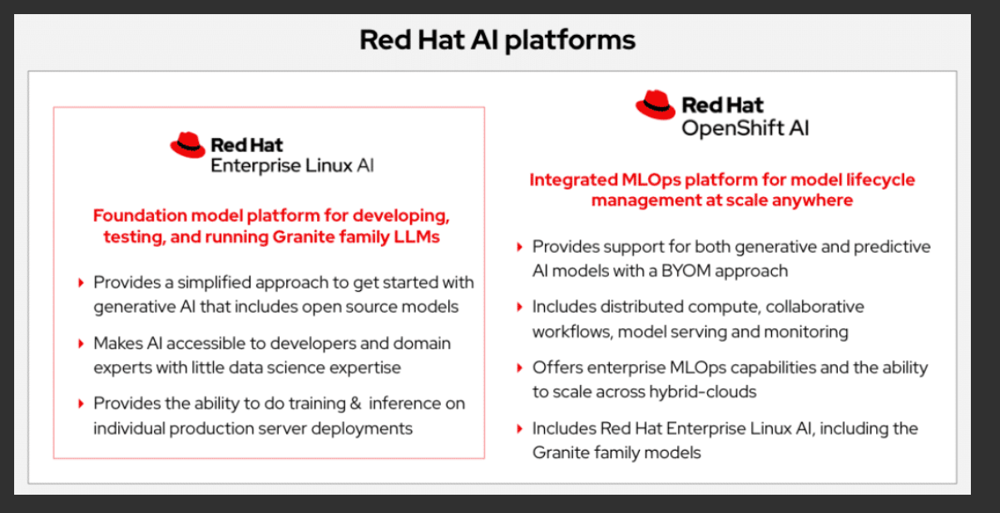

# Red Hat Enterprise Linux AI (RHEL AI)

*RHEL AI serves as a foundation model platform, seamlessly facilitating the development, testing, training, and inferencing of generative AI (GenAI) models for enterprise applications.*

- The Granite family of open source Apache 2.0-licensed LLMs with complete transparency on training datasets.
- A bootable image of RHEL includes popular AI libraries such as PyTorch and hardware optimized inference for NVIDIA, Intel, and AMD.

Red Hat AI platforms
- RedHat Enterprise Linux AI
  - Foundation model platform for developing, testing and running Granite family LLMs
    - provides generative AI 
    - accessable AI to eveyone.
    - ability to do training & inference  
- RedHat OpenShift AI 
  - Integrated MLOPs platform for model LifeCycle Management at scale anywhere
    - provide support for generative & predictive AI with BOYM approach
    - includes compute, collaborative workflows, model serving & monitoring 
    - offer MLOPs capability and scale across hybrid-cloud
    - includes RHEL AI with LLM

