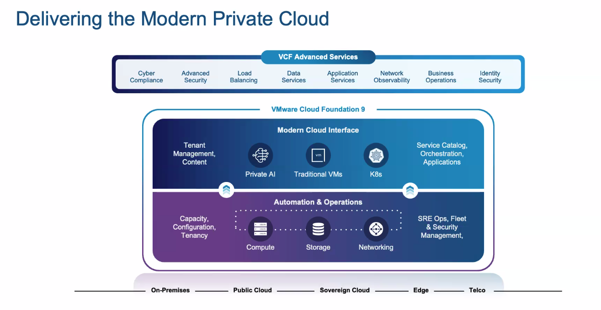
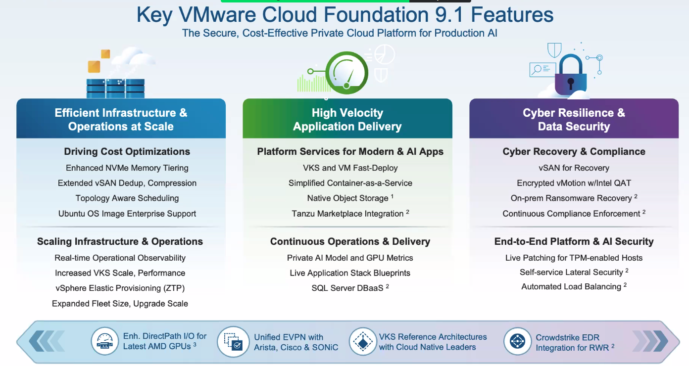
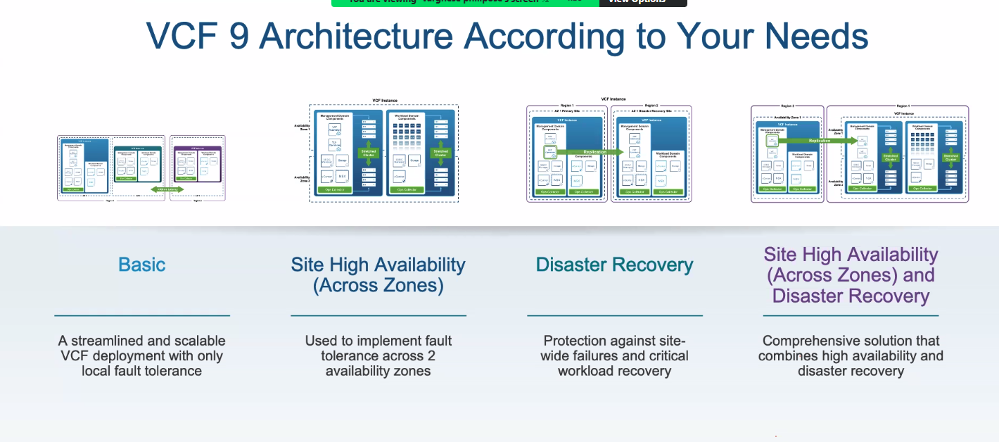

# VMUG - VMWare User Group Pakistan 
2026-09-10 15:00 

## VMWare Cloud Foundation Platform
Trainer : Varghese Philipose

AI is reshaping Enterprise Infrastructure

VCF is a private cloud , single unified platform for your VMs and containers

VCF9 is making everyone to be a private cloud provider

- One interface
- Soverign & Secure 
- Run VMs and COntainer 
- Cost Control 

Major release VCF 9.1 (Secure, Cost effective, private cloud AI )

- Efficent Infrastructure
- High Velocity app delivery
- Cyber resilience and data security

## New functionality
- Perform Greenfield deployment
- Upgrade from vSphere, vSAN, NSX to VCF 9
- Upgrade to existing VCF 

Private Cloud consistency
- Workload domian 
- VCF Instance 
- VCF Fleet 

VCF 9 architecture 
- Basic 
- Site HA (Across Zones)
- DR 
- Site HA (Across Zones ) and DR 
- 

